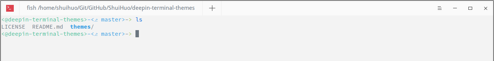
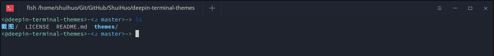

# deepin-terminal-themes

## 使用方法

　　将 `themes` 里面的文件复制到 `~/.config/deepin/deepin-terminal/themes` 即可。

## 截图

### Ayu-light

## 参考项目

　　[ayu-colors](https://github.com/ayu-theme/ayu-colors)

## 授权协议

　　GPLv3
